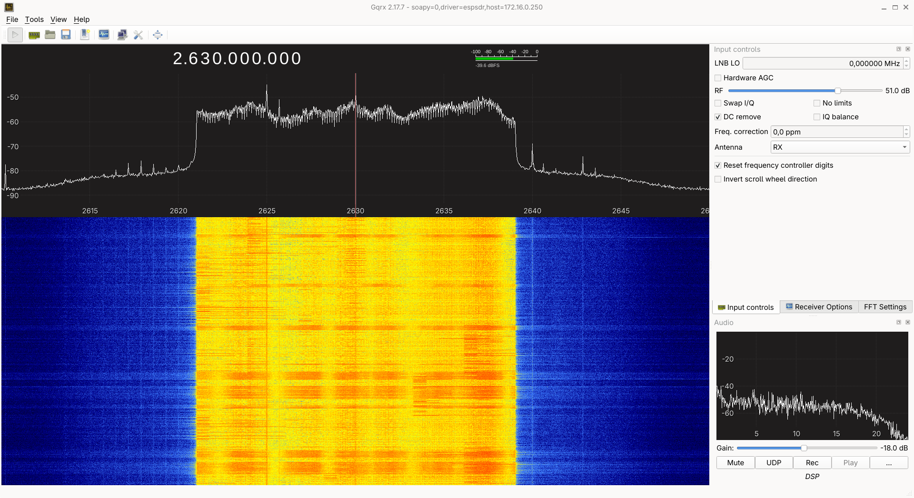

# ESP-SDR firmware


ESP-SDR turns the ESP32's built-in 2.4 GHz Wi-Fi radio into a
**software-defined radio (SDR)**. It lets you capture the radio signal itself
and process it in software, so you can view the spectrum and study signals
beyond ordinary Wi-Fi packets. No separate SDR hardware is needed. The
ESP32-C5 also supports reception in the 5 GHz band.

With the help of LLMs, we discovered an undocumented debug path that bypasses
the chip's fixed-function Wi-Fi modem. This gives software access to raw
radio samples, called **I/Q samples**, from the built-in receiver. ESP-SDR
captures short bursts of these samples and sends them to your
computer over USB or UART for analysis. It can also compute spectra on-device,
including continuous RF capture on selected chips.

<br clear="all">


The diagram shows the hardware's receive and transmit paths; this firmware
currently implements reception only.

[Project overview](https://espargos.net/espsdr/) ·
[Browser SDR viewer](https://espargos.net/espsdr/app/) ·
[Browser firmware installer](https://espargos.net/espsdr/app/flash.html)

**Parts of the firmware code are AI-generated.**
While we have a very good understanding of how the IQ sampling functionality works on the ESP32-C61 chip (used in our ESPARGOS One array), making IQ sampling work on the whole range of ESP32 family chips would have been too much work without LLM support.

## Chip support

| Chip | Status | Native USB | UART0 TX / RX | Minimum flash | Special modes / firmware |
| --- | --- | --- | --- | --- | --- |
| ESP32 | ✅ | — | GPIO1 / GPIO3 | 2 MB | — |
| ESP32-C2 | ✅ (26 MHz crystal) | — | GPIO20 / GPIO19 | 2 MB | — |
| ESP32-C3 | ✅ | Serial/JTAG | GPIO21 / GPIO20 | 2 MB | — |
| ESP32-C5 | ✅ | Serial/JTAG | GPIO11 / GPIO12 | 2 MB | — |
| ESP32-C6 | ✅ | Serial/JTAG | GPIO16 / GPIO17 | 2 MB | — |
| ESP32-C61 | ✅ | Serial/JTAG | GPIO11 / GPIO10 | 2 MB | — |
| ESP32-H2 | ✅ | Serial/JTAG | GPIO24 / GPIO23 | 2 MB | — |
| ESP32-H21 | 🚧 | — | — | — | — |
| ESP32-H4 | 🚧 | — | — | — | — |
| ESP32-P4 | ❌ | — | — | — | — |
| ESP32-S2 | ✅ | USB-OTG CDC | GPIO43 / GPIO44 | 4 MB | — |
| ESP32-S3 | ✅ | Serial/JTAG | GPIO43 / GPIO44 | 2 MB | [Continuous decimated I/Q over USB (15.625–250 kSa/s)](#s3-streaming) |
| ESP32-S31 | ✅ | Serial/JTAG | GPIO58 / GPIO59 | 2 MB | [High Speed USB / Ethernet streaming at up to 40 MSa/s (experimental)](#s31-streaming) |

✅ Supported · 🚧 Not yet supported · ❌ Unsupported (no integrated radio).

USB, UART, and flash requirements above refer to the standard firmware; see each
special firmware variant for its board requirements.

## Special Chip- / Board-Specific Modes and Firmware

<a id="s31-streaming"></a>

### **ESP32-S31**: Ethernet / high-speed USB streaming

**Experimental:** The S31 streaming mode is under development. Signal quality,
including the remaining DC peak, still needs improvement.

The separate **`esp32s31-stream`** firmware targets the ESP32-S31 Function-CoreBoard
with Gigabit Ethernet and native high-speed USB. It streams receive-only I/Q to
**[SoapyESPSDR](https://github.com/ESPARGOS/SoapyESPSDR)** and includes an on-device web page for receiver controls and
status, with rates up to 20 MSa/s over USB and 40 MSa/s over Ethernet using
8-bit I plus 8-bit Q. The ordinary `esp32s31` firmware provides serial burst/FFT capture
for ESP-WebSDR. See [streaming build, architecture, and protocol](docs/s31-streaming.md).



<a id="s3-streaming"></a>

### **ESP32-S3**: Continuous I/Q streaming over USB

The standard **`esp32s3`** firmware includes an **`IQS`** mode for continuous,
decimated I/Q streaming over native USB Serial/JTAG. The second core filters
and decimates the 16 MSa/s capture stream by powers of two from 64 to 1024,
giving output rates from **250 down to 15.625 kSa/s**, with 4, 8 or 16 bits per
I and Q component. This mode requires native USB; UART is not supported.

Use [esp-sdr-bridge](https://github.com/z2labs/esp-sdr-bridge) to connect the
receiver to SDR++, SDR#, Gqrx or GNU Radio through SpyServer / rtl_tcp.
For custom clients, `IQS 0 64 8 6` starts a 250 kSa/s stream with 8-bit I and
8-bit Q until the host sends a byte to stop it. Frames include sample indices,
gap flags and CRC32 checksums; host stalls or processing overruns can cause
sample loss. See the [continuous I/Q protocol](docs/iq-stream.md) for command
options, sample formats, filtering and frequency-offset tuning.

## On-chip spectrum streaming

The firmware can compute FFTs on the device and send compact spectra instead
of raw I/Q. The viewer queries each device's supported rates, FFT sizes and
transport before offering this mode.

| Chip | Continuous RF capture with on-chip FFT | Snapshot FFT |
| --- | --- | --- |
| ESP32 | — | 256–2048 bins; 16/40/80 MS/s; UART |
| ESP32-C2 | — | 256–2048 bins; 80/40/16 MS/s; UART |
| ESP32-C3 | — | 256–2048 bins; 80 MS/s; USB or UART |
| ESP32-C5 | — | 256–2048 bins; 4/8/10/20/40/80 MS/s |
| ESP32-C6 | 256 bins; 80 MS/s; native USB | 512–2048 bins over USB; 256–2048 over UART |
| ESP32-H2 | — | 256–2048 bins; 6.4/10.667/16/32 MS/s; USB or UART |
| ESP32-C61 | 256 bins; 4/8/10/20/40/80 MS/s; native USB | 512–2048 bins over USB; 256–2048 over UART |
| ESP32-S2 | — | 256–2048 bins; 16/40/80 MS/s; USB or UART |
| ESP32-S3 | 256–2048 bins; 16/40/80 MS/s; native USB | — |
| ESP32-S31 | 256–2048 bins; 4/8/10/20/40/80 MS/s; native USB | Same FFT sizes and rates over UART |

Continuous capture keeps the RF writer running, but the CPU analyzes only
selected FFT windows. It does **not** deliver every sample or guarantee that
every short RF event will be visible. Snapshot FFT stops reception between
captures; the viewer labels these gaps explicitly. Raw I/Q capture remains
available separately.

The original S3 Turbo Mode was developed by Zoltan Doczi from
[Z2Labs](https://www.z2labs.io/). The shared implementation extends it with
C6/C61 bank rotation, S31 dual-core SIMD processing with
continuous bank rotation, and portable snapshot FFTs.
See [spectrum protocol and hardware validation](docs/spectrum.md) for the
wire format, limitations and test results. The S3 ring diagnostic host tool
is [tools/s3_ring.py](tools/s3_ring.py).

GPIO outputs can be controlled from the browser’s GPIO section or the serial
protocol. Firmware reports available pins; each supports high impedance (Z),
low (0), or high (1). See [GPIO controls](docs/rx-controls.md#gpio-outputs).

## Commands and transport

Connect over native USB or a 3.3 V USB-to-UART adapter with crossed TX/RX
and common ground, using the pins above. Both interfaces carry the same
request/response protocol: send newline-terminated ASCII commands and read
text replies. Capture replies also include a binary I/Q payload.

Query `INFO` and `CAPS` to identify the firmware and supported features.
`VERSION?` reports the Git revision and UTC build date/time; see
[firmware version reporting](docs/firmware-version.md).
`LIMITS?` reports receive-control limits, `RANGE?` reports the tuning range,
and `TRANSPORT?` identifies the active interface. Configure reception with
`FREQ <MHz>`, `BANDWIDTH <MHz>` and `GAIN` commands.

Request a snapshot with `CAP16 <samples> <rate-index>` for signed 8-bit I/Q
or `CAP20 <samples> <rate-index>` for packed signed 10-bit I/Q. The reply is
`DATA <samples> <crc32-hex> <capture-microseconds>`, followed by exactly
`ceil(samples × bits-per-component × 2 / 8)` binary bytes. Verify the
payload CRC32 before using the samples. Rate indices 0–6 select 80, 40, 20, 10,
8, 4 or 16 MS/s respectively; use only rates advertised by `LIMITS?`.

Finish reading each reply before sending another command. Failures return
`ERR <reason>`. `SYNC <nonce>` echoes the nonce to let clients resynchronize
after an incomplete transfer. One client controls the radio at a time;
`RELEASE` or five seconds of idle time releases it, while other clients
receive `ERR busy`.

## Build and flash

[firmware-targets.json](firmware-targets.json) lists the supported firmware variants and
pins their ESP-IDF commits, including the preview SDK for S31. Check out the
matching SDK, initialize its submodules, run `install.sh <target>`, and source
`export.sh`.

Use a separate build directory and configuration for each chip:

```sh
idf.py -B build-s3 -DIDF_TARGET=esp32s3 \
  -DSDKCONFIG=sdkconfig.s3 \
  -DSDKCONFIG_DEFAULTS=sdkconfig.defaults.esp32s3 build
idf.py -B build-s3 -p /dev/ttyACM0 flash
```

Substitute the target and paths for your chip. S31 also requires `idf.py --preview`.

The C2 firmware uses a **26 MHz crystal**, as on the tested ESP8684H board.
For a 40 MHz board, select `CONFIG_XTAL_FREQ_40=y` in menuconfig and rebuild;
the packaged browser image requires 26 MHz. C2 uses UART0 at 2 Mbaud by
default. With a CH340 bridge, use the viewer's **Switch to 1 Mbaud** warning
when transfers lose bytes; baud changes are session-only. C2 provides raw
IQ8/IQ10 captures, hardware/manual gain, and snapshot FFTs. Continuous capture
is not advertised; approximate analog bandwidth covers 12–20 MHz.
See [C2 backend and validation](docs/esp32c2.md).

The `esp32h2` firmware uses the Bluetooth PHY capture engine and supports
both native USB Serial/JTAG and UART0. It supports 32, 16, approximately 10.667 and 6.4 MS/s hardware sampling,
plus approximately 4–11 MHz analog bandwidth control.
See [H2 backend and validation](docs/esp32h2.md).

## Source layout

- `main/targets/<target>/`: chip receiver or adapter, tuning helpers, and the
  linker guard for its capture SRAM. CMake selects only the requested target.
- `main/targets/esp32s31/burst/`: serial IQ capture and on-chip FFT firmware.
- `main/targets/esp32s31/streaming/`: continuous USB/Ethernet IQ application for
  SoapyESPSDR. Both S31 firmware variants share `main/targets/esp32s31/tuning.h`.
- `main/families/c5_c6_c61/`: receiver shared by C5, C6, and C61; its `chip.h`
  comes from the selected target directory.
- `main/common/`: burst serial transport, gain control, limits, and bandwidth
  helpers. The gain-table wrapper is linked only for C61 and S31.
- `main/diagnostics/`: optional register probes, excluded from release exports.
- `platform/esp32s2/`: pinned ROM USB CDC compatibility component.

The application component and UART configuration stay in `main/`. Target SDK
defaults stay at the repository root for the build tools and ESP-IDF defaults
lookup. The firmware uses the burst protocol over UART/native USB; the separate
`main/targets/esp32s31/streaming/` application implements the receive-only Ethernet and
vendor USB streaming firmware.

Run `python3 -m unittest discover -s tests` for host checks. Build every firmware variant
with `tools/build_firmware.py` and its pinned SDK before distributing a change;
the CI matrix does this automatically. Preserve the target SRAM guards and
gain-table linker wrappers when moving or refactoring receiver code.

## Receive controls

Hardware AGC is the default. `GAIN MANUAL <index>` sets manual gain;
`GAIN HARDWARE` restores AGC. `LIMITS?` reports available gain indices,
bandwidths, sample rates and bit depths. `BANDWIDTH <MHz>` sets approximate
analog bandwidth; zero selects the widest setting.

All supported burst targets accept tuning attempts from **100–6000 MHz in 1 MHz steps**.
The viewer shows an informational warning outside 2400–2483.5 MHz, with
5150–5895 MHz also treated as the supported 5 GHz Wi-Fi band on C5. The warning never blocks tuning.
These are software attempt limits, not a guaranteed reception range.
ESP32, S2, S3, C2, C3 and C6 automatically use the experimental **5/6 LO mode from
1842–2209 MHz**, extending reception down to about **1.84 GHz** on the tested
boards. No extra command or browser setting is needed. An equivalent divider
mode is not yet verified on C5, C61, H2 or S31. C61 and S31 instead recover
failed low-band PLL calibration automatically, with reception verified down
to **2.18 GHz and 2.15 GHz**, respectively, on the tested boards. This uses
hardware capacitor calibration and also applies to S31 streaming; the
achievable range depends on the individual chip.

- **ESP32:** 80/40/16 MS/s.
- **C2:** 80/40/16 MS/s; up to 8,190 complex samples; approximately 12–20 MHz analog bandwidth.
- **H2:** 32/16/10.667/6.4 MS/s; approximately 4–11 MHz analog bandwidth; up to 16,380 complex samples.
- **C3:** 80 MS/s; 14–62 MHz analog bandwidth.
- **C5:** 11–48 MHz bandwidth; selects its 5 GHz RF path above 3000 MHz.
- **C61:** 80/40/20/10/8/4 MS/s; 13–54 MHz bandwidth.
- **C6:** 80 MS/s; 12–54 MHz bandwidth.
- **S2:** 80/40/16 MS/s; 15–60 MHz bandwidth; up to 12,284 complex samples.
- **S3:** 13–69 MHz bandwidth.
- **S31:** 80/40/20/10/8/4 MS/s; 13–54 MHz bandwidth.

Captures have gaps; nominal sample rates exceed sustained serial throughput.
Gain and power are uncalibrated. Extended tuning does not guarantee PLL lock
or reception; the viewer uses the ISM-band warning described above.

See [receive-control details](docs/rx-controls.md).

## Contributors

<table>
  <tr>
    <td align="center">
      <a href="https://github.com/Jeija">
        <br>
        <b>Florian Euchner</b>
      </a>
    </td>
    <td align="center">
      <a href="https://github.com/zodoczi">
        <br>
        <b>Zoltan Doczi</b>
      </a>
    </td>
  </tr>
</table>

Special thanks to [h0m3us3r](https://github.com/h0m3us3r) for providing
[eSpDR](https://github.com/h0m3us3r/eSpDR), whose 5/6 LO investigation informed
our lower-frequency tuning implementation.

## License

ESP-SDR is licensed under the GNU General Public License as published by the
Free Software Foundation, either version 3 of the License, or (at your option)
any later version (`GPL-3.0-or-later`). See [LICENSE](LICENSE) for the full terms.
It is provided without any warranty, including implied warranties of
merchantability or fitness for a particular purpose.

**We chose the GPL because we want improvements to ESP-SDR to make their way
back to the community**. When you distribute modified versions, the GPL requires
you to make the corresponding source available to recipients under the GPL,
so they can study, share, and build on those improvements. We encourage you to
contribute changes upstream, but the GPL does not require upstream submissions
or publication of private modifications. See the
[GNU GPL FAQ](https://www.gnu.org/licenses/gpl-faq.html#UnreleasedMods).

The discovery of the capture mechanism itself is not protected by copyright:
copyright covers the code and other copyrightable expression, not the
underlying facts, ideas, or methods. **You are free to independently implement
the mechanism in your own projects under a license of your choice**.

Third-party components retain their own licenses and copyright notices,
including the Apache-2.0 ESP-IDF compatibility code in
`platform/esp32s2/esp_usb_cdc_rom_console/`, the pinned
[ESP-DSP component](components/esp-dsp/LICENSE), and the derived FFT kernels
in `main/targets/esp32s3/s3_fft_rnd.S` and `main/targets/esp32s31/burst/s31_fft_rnd.S`.
