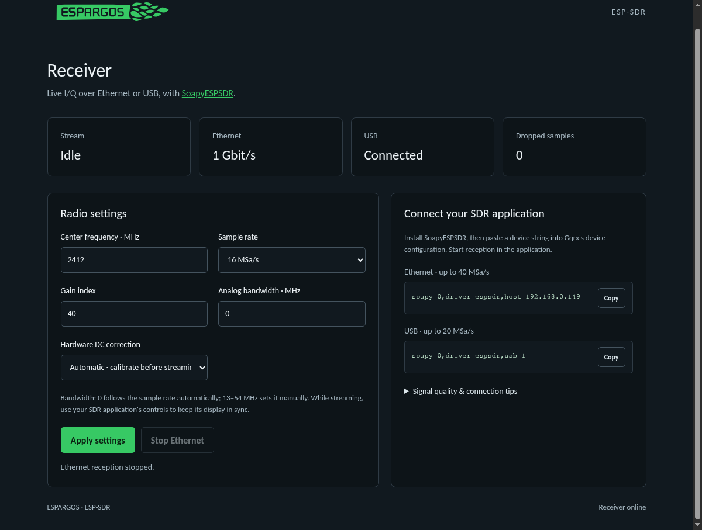
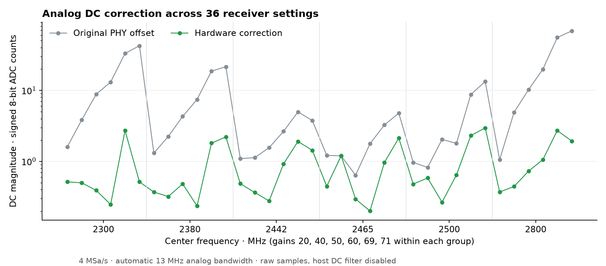
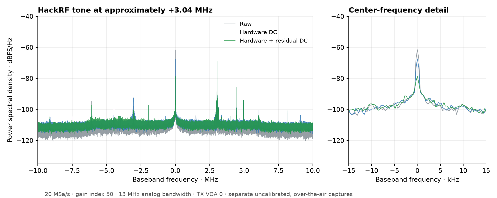

# S31 usability and signal-quality validation — 2026-10-02

The measurements below describe the quality checkpoint. See the release cleanup
section at the end for the subsequently packaged image and its regression checks.

The final `esp32s31-stream` firmware adds the ESPARGOS web interface,
hardware DC calibration, and automatic analog bandwidth. SoapyESPSDR 0.3.0
adds optional residual DC removal and more tolerant USB buffering.

Local checkpoints before these changes: esp-sdr `ab716db`, SoapyESPSDR
`4171536`, esp-web-sdr `0c6749c`. No remote publication was performed.
The [original streaming report](s31-streaming-2026-10-02.md) describes the
checkpointed version.

Hardware: ESP32-S31 Function-CoreBoard, YT8531 Gigabit Ethernet, native
high-speed USB, Linux host, recovery UART at 115200 baud, and HackRF One.
The host used wired Ethernet and its Wi-Fi was left disabled. ESP-IDF is pinned
to `c712a0dde385d659a1470a136251980d31a70bc1`.

The final flashed and web-flasher-packaged application, package version
`streaming-quality-20261002`, has SHA-256:

`1e301a92174486482e27cb2d3637c231c7103da533516fa3ea6ccd12290d7c1e`.

The final results below use that image. Intermediate development logs are
retained separately to document failures and the fixes they prompted. Archived
text logs normalize the local workspace path to `<workspace>`; measurement
values are unchanged.

## Continuous reception and regression checks

Rates are **complex samples per second**, each containing signed 8-bit I and
signed 8-bit Q. The monitors check source sample positions, host queue drops,
invalid packets, overflow returns, and timeouts. All three final runs passed:

| Transport / conditions | Rate | Duration | Delivered complex samples | Missing / queue drops / invalid / overflows / timeouts |
| --- | ---: | ---: | ---: | --- |
| USB, concurrent web requests | 20 MSa/s | 600 s | 11,993,694,048 | 0 / 0 / 0 / 0 / 0 |
| Ethernet, concurrent web requests | 40 MSa/s | 600 s | 23,980,643,904 | 0 / 0 / 0 / 0 / 0 |
| USB, after reset/RF/DC tests, ten 25 ms host pauses | 20 MSa/s | 300 s | 5,984,072,640 | 0 / 0 / 0 / 0 / 0 |

Wall time includes activation/calibration, so total counts can be slightly
below nominal rate × duration without missing source samples. Monitors request
CS8 with DC correction enabled. The first two runs included respectively 597
and 583 HTTP status requests, plus repeated page/logo downloads. All firmware
capture, DMA-overrun, ring, and transport drop counters remained zero during
those runs. They followed the control/restart sequence without a board reset.

[USB log](s31-quality-data/priority24-usb-endurance.log),
[USB status before](s31-quality-data/priority24-usb-before.json) and
[after](s31-quality-data/priority24-usb-after.json);
[Ethernet log](s31-quality-data/priority24-ethernet-endurance.log),
[Ethernet status before](s31-quality-data/priority24-ethernet-before.json) and
[after](s31-quality-data/priority24-ethernet-after.json).

The last run followed intentional USB bus resets, RF captures, and another DC
matrix. Lifetime counters after fault injection were nonzero; the last run
added **no** firmware drops and had no host gaps. Its ten deliberate 25 ms
process pauses also passed.
[Last USB log](s31-quality-data/priority24-tail-usb.log),
[before](s31-quality-data/priority24-tail-before.json) and
[after](s31-quality-data/priority24-tail-after.json) firmware status.

The final image/driver also passed:

- 120 USB control cases across all advertised rates and CS8/CS16/CF32, including
  live frequency/gain/bandwidth changes, timestamps and partial reads.
- 100 USB start/stop cycles at 20 MSa/s and 45 Ethernet control cases.
- A further 120-second USB run with ten 25 ms host pauses after that sequence.
  All firmware loss counters were still zero.
- Five USB resets while calibration occupied the control worker, each followed
  by successful, lossless 20 MSa/s reception.
- Ten USB restart cycles at 4 MSa/s under AddressSanitizer/UndefinedBehaviorSanitizer.
- 29 firmware host tests, including cross-coupled/inverted DAC response, gain
  preservation, bounds, singular response, and failure rollback.
- Three Soapy CTest tests and seven public-API loopback tests, normally and under
  sanitizers. These include exact raw bypass, partial reads, format conversion,
  hardware DC propagation, and host-only fallback for older firmware.
- 85 web tests, browser UI checks, and integrity checks for all nine packages.

[USB controls](s31-quality-data/priority24-controls-usb.log),
[restarts](s31-quality-data/priority24-restarts-usb.log),
[Ethernet controls](s31-quality-data/priority24-controls-ethernet.log),
[post-sequence status](s31-quality-data/priority24-lifecycle-after.json),
[reset recovery](s31-quality-data/priority24-reset-recovery.log), and
[sanitized USB restarts](s31-quality-data/priority24-asan-usb-restarts.log).
Python leak detection was disabled for interpreter allocations; ASan/UBSan
remained enabled. The loopback log's invalid-packet error is its deliberate
malformed-packet rejection test.

Final driver review also found that whole-microsecond packet timestamps could
move backwards across a partial-read packet boundary at 20/40 MSa/s. The driver
now recovers the fractional microsecond from the source sample index. A new
regression test reproduced the failure before the fix and passed afterward,
normally and under sanitizers. A subsequent live check verified exact sample
timestamps across 19 packet boundaries each over USB at 20 MSa/s and Ethernet
at 40 MSa/s ([results](s31-quality-data/timestamp-live.txt)). The endurance runs
above preceded this timestamp-arithmetic-only driver fix.

### USB fixes found during testing

Hardware calibration originally ran in TinyUSB's callback, blocking IQ
completion handling. USB JSON/calibration now runs on a separate priority-18
worker; endpoint handling remains short, and session generations discard stale
replies after reset.

Longer tests then exposed intermittent ring losses. The host now queues
32 × 64 KiB reads (about 50 ms at 20 MSa/s) instead of eight, and DC processing
runs outside the receive-queue mutex. In a controlled comparison, ten 25 ms
process pauses caused 2,453,532 missing samples with the previous driver and
zero with the larger queue.
[Previous driver](s31-quality-data/usb-scheduling-old.log),
[updated driver](s31-quality-data/usb-scheduling-new-2442.log).

That alone was insufficient: an intermediate firmware passed long runs but
later lost 53,208 samples after repeated reconfiguration. USB and Wi-Fi both
ran at priority 23. A 1 ms scheduling interval is comparable to the entire
sample ring's capacity at 20 MSa/s. USB endpoint handling now shares the
sender's priority 24, above Wi-Fi; expensive control work stays at 18.
The [boot log](s31-quality-data/priority24-boot.log) confirms these priorities.
The final validation above passed after this change.
[Intermediate failing run](s31-quality-data/priority23-warm-usb.log).

These are results for this board and host, not guarantees for every USB
controller or network. Simultaneous HackRF transmission on the shared USB 2 hub
was previously found to reduce available bandwidth; RF tests use Ethernet.
Use a separate bus or 16 MSa/s USB when other traffic causes losses.

## Device web interface and installer

The device serves the existing ESPARGOS SVG logo and uses the controller's
charcoal/green palette. It has responsive controls, connection/loss status,
copyable Gqrx strings, automatic bandwidth, and hardware DC correction. It
preserves pending edits across polling and validates settings before sending
them. The redundant “S31 Receive Only” banner is removed.

Browser checks covered desktop/mobile layout, the logo, invalid bandwidth,
automatic bandwidth, DC toggling, pending edits, real clipboard clicks, and
stopping a live Ethernet stream. The final device serves byte-for-byte the
same tested HTML/SVG sources. The flasher's streaming profile directs users to
SoapyESPSDR; the ordinary S31 profile keeps its serial-viewer destination.
Only the streaming application/build metadata and manifest entry changed;
the other eight packaged profiles, streaming bootloader, and partition table
are unchanged. CLI flashing verified the application hash. Browser WebSerial
flashing itself was not automated.

## Hardware DC correction

Hardware correction is enabled after boot. Before each acquisition epoch,
firmware measures raw samples, identifies the two baseband DC DAC response
vectors, and adjusts the hardware DACs. It preserves the live RF/baseband gain
controls, bounds changes, and restores the best measured setting after an
unsuccessful trial. It writes no persistent calibration.

Measurements allow 50 ms of sampling-clock settling. Calibration adds a few
hundred milliseconds to startup/retuning, potentially about two seconds for a
difficult case. It inserts no calibration pauses into steady reception.

The final image was measured at six frequencies (2300, 2380, 2442, 2465, 2500,
2800 MHz) and six gain indices (20, 40, 50, 60, 69, 71), correction off/on at each
setting. These are 72 raw captures at 4 MSa/s with 13 MHz analog bandwidth,
about 400,000 complex samples each after 150 ms settling. HackRF transmission
and host DC filtering were off. Out-of-band frequencies are diagnostic
observations, not sensitivity specifications.

For the 20 pairs whose original DC magnitude exceeded three signed ADC8 counts,
the median reduction was **20.6 dB**. Examples:

| Center / gain index | Original DC magnitude | Hardware corrected |
| --- | ---: | ---: |
| 2300 MHz / 50 | 8.83 | 0.39 |
| 2300 MHz / 71 | 42.50 | 0.52 |
| 2380 MHz / 69 | 18.63 | 1.81 |
| 2800 MHz / 69 | 55.41 | 2.72 |
| 2800 MHz / 71 | 68.51 | 1.94 |

Units are signed ADC8 counts, magnitude of the mean I/Q vector. Small offsets
do not always improve; 2465 MHz/gain 40 stayed near 1.2 counts. Drift between
calibration and capture remains measurable. Earlier matrices measured median
reductions of 21.4 and 20.8 dB under the same large-offset criterion. This is
not a promise of zero DC at every frequency, gain, temperature, or on another
board. [Final raw measurements](s31-quality-data/dc-matrix.json).

Soapy's standard automatic DC mode controls hardware correction and an optional
continuous 10 Hz host estimator for residual drift:

- `dc_offset=true`: hardware plus residual correction.
- `dc_offset=true,dc_residual=false`: hardware only.
- `dc_offset=false`: raw samples, both corrections disabled.

Without an explicit argument, Soapy respects the device's current setting
(enabled after boot). Older firmware without hardware support gets host-only
correction. The residual filter attenuates signals very close to DC and cannot
restore clipped ADC headroom. Integer output rounds/saturates; CF32 preserves
fractional corrections and may exceed the nominal ±1 range. Fractional values
do not represent additional ADC bits.

## Bandwidth, noise, and known-tone measurements

Automatic bandwidth follows sample rate with a 13 MHz minimum: 4/8 MSa/s →
13 MHz, 16 → 16 MHz, 20 → 20 MHz, 40 → 40 MHz. Explicit 54 MHz retains the
former widest setting. Only the streaming profile changes semantics. At
4/8 MSa/s the analog passband is still too wide to prevent all aliasing.

Eighteen transmitter-off captures compared explicit 54/13 MHz settings at
4/20/40 MSa/s, three repetitions each, at 2442 MHz/gain 50. Median full-spectrum
noise-density reductions were 10.8, 4.6 and 12.3 dB respectively. These include
ambient signals, quantization and filter response; they are **not receiver
noise figures or calibrated sensitivity improvements**. At 40 MSa/s, much of
the 13 MHz-filtered spectrum is intentionally attenuated, so its median falls
in that region. A narrower filter trades usable bandwidth for rejection.
Automatic 40 MHz bandwidth is not the same as this explicit 13 MHz comparison.

Weak-tone captures initially used HackRF CW at 2445 MHz, 2 MSa/s, amplitude 32,
TX VGA 0, amplifier off, with reception over Ethernet. One 54 MHz capture had
a stronger unrelated peak near +3.95 MHz. Its generic strongest-peak metric
must not be interpreted as the HackRF tone or receiver image rejection.
[Noise and weak-tone metrics](s31-quality-data/rf-metrics.json).

A further comparison used TX VGA 16, amplifier still off, and explicitly
searched within 100 kHz of the expected +3 MHz tone. Three repetitions of raw,
hardware-only and combined correction were interleaved, at 20 MSa/s,
2442 MHz/gain 50, 13 MHz bandwidth. Median results:

| Correction | Tone power, dBFS | Mean DC, dBFS |
| --- | ---: | ---: |
| Off | −27.11 | −36.66 |
| Hardware | −27.18 | −50.91 |
| Hardware + residual | −27.15 | −64.36 |

Median tone-power change was below 0.1 dB. The observed tone was near
+3.041 MHz; neither oscillator was calibrated. Measured image rejection ranged
34–44 dB across these captures and includes the entire uncalibrated test setup.
All capture loss sensors were zero. HackRF transmissions were bounded and
stopped after testing. [Known-tone measurements](s31-quality-data/known-tone.json).

Each RF metric uses 1,048,576 samples after 0.3 s settling, 65,536-point Hann
FFTs, window-energy/sample-rate normalization, and seven integrated bins for
tone power. `SoapyESPSDR/tests/live_quality.py` never starts a transmitter;
`--tone-offset` limits selection when an external test tone is known.

The plot below uses the separate TX-VGA-0 captures at 13 MHz bandwidth.
DC correction does not eliminate broader center-frequency noise or other spurs.

[Averaged spectra](s31-quality-data/tone-spectra.npz) contain unshifted linear
power-density arrays `psd_off`, `psd_hardware`, `psd_both` and sample-rate/FFT
metadata. Load with NumPy without pickle; use `fftfreq`, `fftshift`, and
`10*log10` to reproduce the plotted spectra.

## Precision limitation and final state

True continuous IQ10 is **not implemented**. The source has ten bits per
component, but this backend captures the upper eight of each through sixteen
PARLIO lanes. The pinned SDK exposes one PARLIO RX unit with at most sixteen
data lanes; its camera HAL also exposes at most sixteen parallel bits. Genuine
IQ10 requires a new capture route or proven serialization/synchronized receivers.
The wider TCM snapshot path does not establish gap-free continuous operation.
CS16 and CF32 remain conversions of native IQ8. This is a limitation of this
backend, not proof that every possible S31 design is incapable of IQ10.

After the fault-injection tests, the final firmware was freshly booted and left
idle at 2412 MHz, 16 MSa/s, gain 40, automatic bandwidth and hardware DC correction,
with clean boot counters. HackRF transmission and temporary browser-test
servers are stopped. [Final idle status](s31-quality-data/final-idle-status.json).

## Release cleanup after the quality checkpoint

The validated state was checkpointed locally as esp-sdr `1e3a2d4`,
SoapyESPSDR `0a94b8e`, and esp-web-sdr `5841e23`.

The subsequent driver cleanup removes capability detection and host-only
fallback for pre-release firmware without hardware DC calibration, together
with its obsolete test. Hardware DC control is now unconditional; the control
response must contain a valid DC setting. The optional host residual filter
remains available. Wire protocol 2 and the sample-processing behavior are unchanged.

The only firmware source change is linking the ESPARGOS logo to
`https://espargos.net/`. The rebuilt image was flashed, verified, and packaged
in the web installer as `streaming-cleanup-20261002`, application SHA-256:

`dca0a9fb7c6b85b7c9b44463367f5e82ca15808029be4f84fe4871df3001e49c`.

Validation passed: three CTest and six public-API loopback tests, both normally
and under ASan/UBSan; 85 web tests; all nine firmware package integrity checks;
and 12 USB plus 15 Ethernet control cases across all supported rates and formats.
The live page/logo matched the source, including the website link.
The receiver was restored to default idle settings with zero drop counters.
The earlier endurance and RF measurements were not repeated for this cleanup.
[Regression results](s31-quality-data/cleanup-validation.txt),
[idle status](s31-quality-data/cleanup-idle.json).

## Ethernet congestion and Gqrx startup recovery

A later setup at `172.16.0.250` reproduced a Gqrx hang and HTTP timeouts at
20 MSa/s. The board had no firmware panic or capture/transmit drops, while
only approximately 5.8 MSa/s reached the host, consistent with a 100 Mbit/s
bottleneck somewhere in the path. Both endpoint links reported gigabit.
A 4 MSa/s, 20-second run delivered 78,188,544 samples without loss.
Moving the host and receiver onto the same gigabit switch resolved the loss:

| Rate | Duration | Delivered samples | Missing / queue drops / invalid / overflows / timeouts |
| --- | ---: | ---: | --- |
| 20 MSa/s | 20 s | 391,437,312 | 0 / 0 / 0 / 0 / 0 |
| 40 MSa/s | 20 s | 783,111,840 | 0 / 0 / 0 / 0 / 0 |

Gqrx's failing DSP source had thrown a control timeout during activation;
its main thread was waiting in GNU Radio's scheduler startup. The driver
previously sent a cleanup stop only if the start reply had arrived. A lost
reply could therefore leave the receiver flooding the constrained path.
Activation now attempts cleanup even after a failed start reply. Operational
activation/deactivation failures log the cause and return a Soapy stream error.
The [gr-osmosdr Soapy source](https://github.com/osmocom/gr-osmosdr/blob/master/lib/soapy/soapy_source_c.cc)
uses those return values in its start/stop callbacks.

Eight loopback tests and three CTest checks passed under ASan/UBSan, including
truncated start/stop replies and successful retry. An actual Gqrx instance
also remained responsive after an injected damaged start reply; the simulated
receiver was stopped and retry succeeded. Gqrx's DSP indicator still read on
after the failed activation, so its indicator alone does not prove reception.
On hardware, Gqrx ran at both 20 and 40 MSa/s; twenty concurrent page requests
per rate all succeeded (maximum latency 9.8 ms and 20.1 ms respectively).

The fix is built locally. The system-installed module requires administrator
access to replace; tests selected the local build with both `SOAPY_SDR_ROOT`
and `SOAPY_SDR_PLUGIN_PATH`. No firmware change was needed. The receiver was
left idle at 20 MSa/s with zero firmware drop counters.
[Detailed results](s31-quality-data/ethernet-path-validation.txt).
