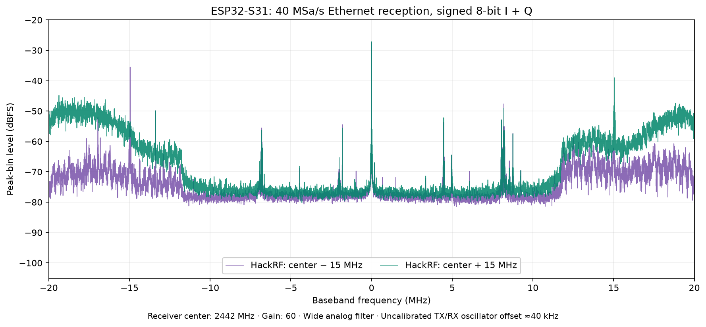

# S31 streaming validation — 2026-10-02

Hardware: ESP32-S31 Function-CoreBoard with YT8531 Gigabit Ethernet and native
480 Mbit/s USB, Linux host, and HackRF One as a bounded-duration test source.
The host used wired Gigabit Ethernet; Wi-Fi on the same subnet was disabled.
The S31 UART adapter remained available for recovery at 115200 baud.

Firmware: `esp32s31-stream`, artifact version `streaming-20261002`, RX protocol
2, ESP-IDF `c712a0dde385d659a1470a136251980d31a70bc1`. SoapyESPSDR: the accompanying
0.2.0 source. These measurements describe this board/host setup, not a guarantee
for every USB controller, network, or application.

Packaged application SHA-256:
`55af9a10e50b2d383267ad1ee3c0fbbf20fb6c4a851d69f138986efc26e1b191`.

## Continuous reception

All rates refer to **complex samples**, each containing signed 8-bit I and
signed 8-bit Q.
The monitor checks absolute source sample positions, host queue loss, invalid
packets, overflow returns, and read timeouts. A discontinuity fails the run.

| Transport | Rate | Duration | Delivered complex samples | Missing / queue drops / invalid |
| --- | ---: | ---: | ---: | --- |
| Native USB | 20 MSa/s | 600 seconds | 11,999,834,784 | 0 / 0 / 0 |
| Gigabit Ethernet | 40 MSa/s | 600 seconds | 23,999,658,144 | 0 / 0 / 0 |

The USB run also had zero overflow returns and timeouts, and all firmware drop
counters remained zero after stopping. It included 300 HTTP status/invalid
control requests and a browser rendering the live controls.
[Full USB monitor log](s31-usb-20msps-600s.txt).

The Ethernet run also had zero overflow returns and timeouts, with all firmware
drop counters still zero after stopping. It included 200 HTTP requests and
20 USB device probes, and the device web page rendered during reception.
[Full Ethernet monitor log](s31-ethernet-40msps-600s.txt).

An earlier 180-second Ethernet run delivered 7,202,160,672 samples at the
40 MSa/s setting with no missing samples, overflows, timeouts, host queue drops,
or invalid packets. That early monitor started its timer after activation,
including some pre-timer queued samples in its average; the final monitor
starts timing before activation.

An earlier 240-second USB run exposed ring pressure during HTTP traffic and
lost 42,426 samples. This was **not** accepted as a passing run. Raising the
USB sender's scheduling priority and making the endpoint semaphore its sole
ownership token fixed the observed starvation/race. A subsequent 45-second
20 MSa/s run with 300 HTTP requests delivered 899,943,744 samples with no loss.

A later Ethernet endurance run exposed 6,198 missing samples while opening
and probing the USB control interface. Firmware counters identified ring
pressure, with no DMA overruns or transport errors. The sender now runs above
USB control callbacks on both transports; it sleeps when the sample ring is
empty. That failed run was stopped and is not counted as a lossless result.

The previous USB sender retained ring slots while waiting for the preceding
transfer even after copying their samples into a private DMA buffer. Short
reopen tests exposed ring pressure in that state. Releasing those slots
immediately after the copy passed 100 consecutive 20 MSa/s reopen cycles,
with zero gaps and zero additional firmware drops. The ring-space check also
accounts for unfinished packets and each actual DMA completion length.

[Machine-readable endurance results](s31-endurance.json) include the exact
application image hash and firmware counter deltas.

## Controls and recovery

- 81 hardware control cases passed: four USB rates and five Ethernet rates,
  each in CS8, CS16, and CF32, with three start/stop cycles per combination.
  Each case included active frequency/gain/bandwidth changes, timestamps,
  a 17-sample partial read, getters, and sample scaling checks. The final
  candidate passed a repeat with continued reception after each retune to
  check for delayed gaps.
- [100 consecutive USB reopen cycles](s31-usb-100-restarts.txt) passed at
  20 MSa/s, center 2452 MHz, gain 50, bandwidth 20 MHz, receiving for half a
  second per cycle. The published `live_restarts.py` then passed another
  100 cycles using the fresh workspace driver build.
- Five additional ordinary start/stop cycles at each transport's maximum
  rate added zero firmware capture or transport drops.
- Deliberately pausing the host consumer for 1.2 seconds filled its bounded
  queue. Both transports reported queue loss and `SOAPY_SDR_OVERFLOW`, then
  reopened successfully. This was an expected-loss recovery test.
- Native USB bus reset during 20 MSa/s reception produced a stream error;
  firmware relinquished the stream and kept its web interface available.
  Reopening USB then received at 20 MSa/s for five seconds with no loss,
  without resetting the ESP32 CPU or reflashing it.
- HTTP controls remain available during USB streaming. Competing Ethernet
  starts, 40 MSa/s configuration while USB owns reception, and malformed JSON
  are rejected without changing the active stream.
- Fifteen invalid-control cases (including oversized bodies, fractional gain,
  unsupported rates, and a valid frequency paired with an invalid bandwidth)
  were rejected with the active USB settings and epoch unchanged.

## RF validation

Receiver center: 2442 MHz, gain 60, widest analog bandwidth (`0`). HackRF One
used 2 MSa/s constant-I transmission, amplitude 32, TX VGA gain 0, amplifier
disabled, bounded to 20 million samples and explicitly stopped after capture.
A separate source transmission and three-second receiver capture were used
for each offset. Neither SDR used an external frequency reference.

| Transport / receiver rate | Source offset | Measured FFT peak | Peak above median FFT-bin level |
| --- | ---: | ---: | ---: |
| Ethernet / 40 MSa/s | +15 MHz | +15,040,436 Hz | 38.8 dB |
| Ethernet / 40 MSa/s | −15 MHz | −14,960,022 Hz | 44.9 dB |
| USB / 16 MSa/s | +1 MHz | +1,040,039 Hz | 31.6 dB |
| USB / 16 MSa/s | −1 MHz | −959,961 Hz | 37.3 dB |

All four RF captures in the table had zero missing samples. Signals at ±15 MHz
establish useful received content beyond a 20 MSa/s Nyquist interval; these
are not padded or repeated 20 MSa/s captures. The approximately 40 kHz offset
is the combined uncalibrated transmitter/receiver error. It does not establish
an absolute S31 frequency error. Peak-to-median-bin ratios are not integrated
SNR or receiver sensitivity measurements.

The S31 and HackRF were connected through the same upstream USB 2.0 hub.
USB reception at 20 MSa/s was lossless with the transmitter off, but concurrent
HackRF USB transmission at 2 MSa/s caused approximately 3.32–3.38 million missing
receiver samples per three-second capture. Reducing receiver throughput to
16 MSa/s removed this loss. This is consistent with shared-bus contention;
20 MSa/s RX with a transmitter on an independent USB bus was not tested.
Use a separate bus or Ethernet when operating both devices at high throughput.
The spectra also contain ambient RF and DC/spurs; the setup was not shielded
or calibrated for receiver sensitivity or dynamic range.



[Capture counters and settings](s31-rf-captures.json),
[Ethernet spectral measurements](s31-40msps-rf.json), and
[USB spectral measurements](s31-usb16-rf.json) accompany the plot.

## Software, builds, and flasher

- Clean catalog-driven streaming build and export passed with the pinned SDK
  and dependency lock. All three exported images were flashed through the
  recovery UART and verified by esptool.
- The ordinary S31 burst target also built successfully; streaming is a
  separate profile and does not replace that application.
- Firmware host tests: 28 passed. Soapy CTest: module load and protocol tests
  passed, including all possible USB packet split positions. Four localhost
  Soapy API tests passed, covering formats, partial reads, timestamps, gaps,
  duplicate packets, initial loss, retuning, malformed packets, and timeouts.
- AddressSanitizer/UndefinedBehaviorSanitizer builds passed CTest and the four
  localhost tests. Leak checking was disabled for the Python interpreter run.
- Staged CMake installation placed the module in `SoapySDR/modules0.8` and
  installed the loss monitor; the installed module passed load/registry/unload.
  `SoapySDRUtil` discovery and both transport probes also passed, advertising
  one RX channel, zero TX channels, and the intended formats and rate lists.
- Web test files: 17 passed. SHA-256, MD5, and sizes matched every packaged
  image in all nine profiles. The eight existing profiles were preserved.
- Chromium rendered the live device controls during streaming. Browser checks
  verified the flasher's preselected streaming profile, all nine choices,
  Soapy setup guidance, and switching back to the ordinary serial-viewer
  guidance. Actual WebSerial flashing was not automated; UART esptool flashing
  of the packaged candidate was tested.
- The live device web form applied frequency, rate, gain, and bandwidth;
  its stop button stopped an actual Ethernet stream. Desktop and phone-width
  layouts were inspected. The board was returned to idle with default settings.

## Reproduce

From the SoapyESPSDR checkout, after building:

```sh
export SOAPY_SDR_PLUGIN_PATH="$PWD/build-rx"
./build-rx/espsdr_loss_monitor --device driver=espsdr,usb=1 --rate 20000000 --seconds 600
./build-rx/espsdr_loss_monitor --device driver=espsdr,host=BOARD_IP --rate 40000000 --seconds 600
python tests/live_control.py --device driver=espsdr,usb=1
python tests/live_control.py --device driver=espsdr,host=BOARD_IP
python tests/live_restarts.py --device driver=espsdr,usb=1 --rate 20000000 --cycles 100
python tests/live_rx.py --device driver=espsdr,host=BOARD_IP \
  --rate 40000000 --frequency 2442000000 --gain 60 --bandwidth 0 \
  --seconds 3 --capture iq.npy --json result.json
```

`live_rx.py` stores interleaved scalar I,Q values; default CS8 captures are signed
NumPy `int8`. Convert to floating point before forming `I + 1j*Q` for FFTs.
The capture is bounded to approximately one million complex samples even when
reception continues longer. These receiver scripts never start a transmitter.

To exercise control traffic while Ethernet is streaming, repeatedly run
`SoapySDRUtil --probe="driver=espsdr,usb=1"` from a second terminal and open the
board's web page. Read-only probes and status requests must not introduce
sample gaps. Changing RF settings intentionally starts a new acquisition epoch.

The firmware relies on chip-specific diagnostic routing and preview S31 SDK
support. Lower rates directly subsample; they do not provide digital anti-alias
filtering. Timestamps are boot-relative with a software start anchor, not
calibrated RF trigger times. See [architecture and protocol](../s31-streaming.md).
